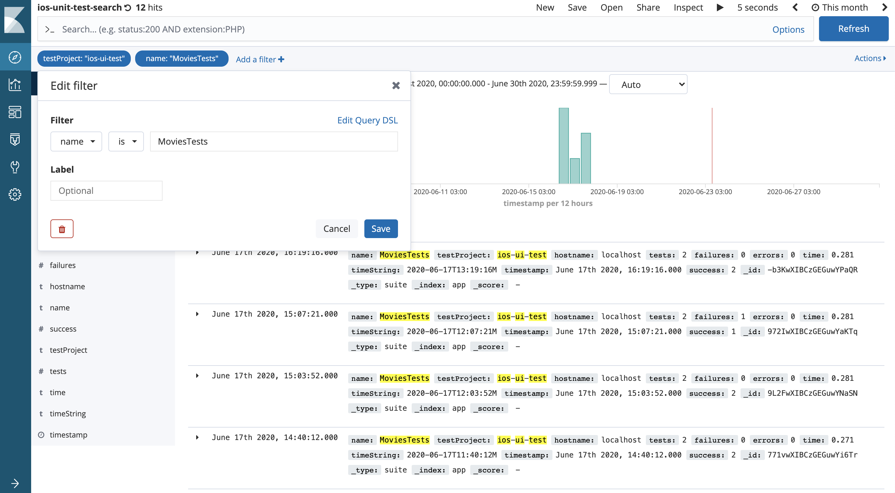
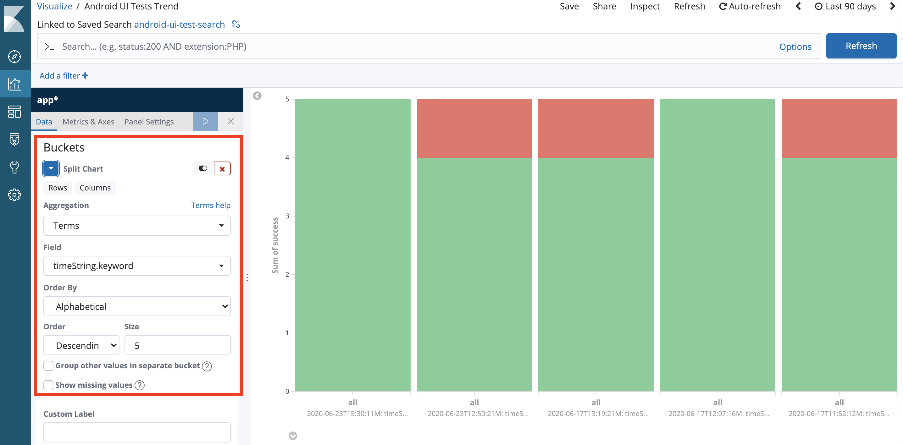
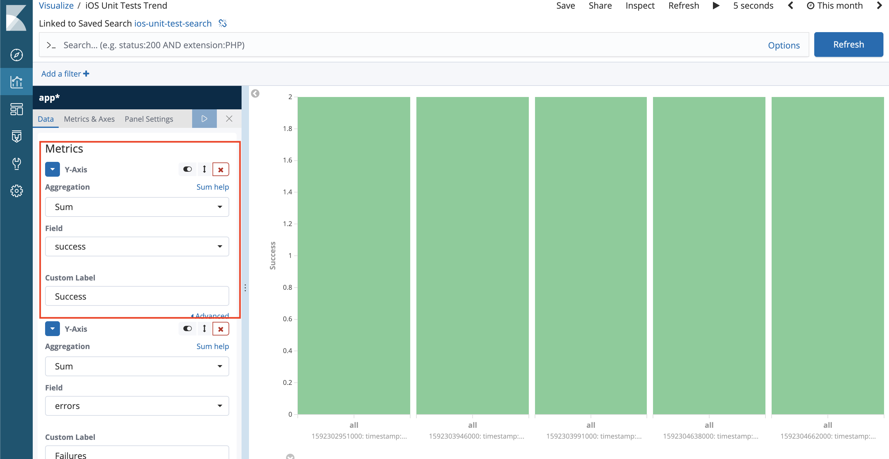
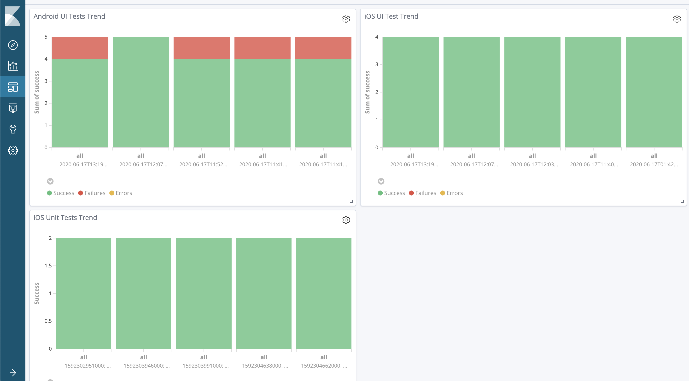

## Export data to Elasticsearch
```bash 
## run test and export data
bash run_tests.sh android
bash run_tests.sh ios

## only export data
python3.6 export_xml_data_elastic.py android
python3.6 export_xml_data_elastic.py ios
```

## Creating Interactive Dashboard on Kibana
### Search on Kibana with timeString
Go to the Discover menu and select one item in the list then click the + button of the related filter item. Once you click the + button next to the timeString item it filters the search item with value timeString has.



### Create Visualizations
Click Visualize then click + button on the middle of the page, it will pop-up types of visualization menu then you can select one of your favorite charts. Then it opens the saved search item, you can select the search you saved in the previous step.

### Kibana setting the metrics and buckets
I choose the bar chart, later I will add one column to show the number of success, failure, and error. As you can see from the picture above you need to define the Metrics and the picture below shows how to split the chart for each run by setting the Buckets.





### Creating an Interactive Dashboard
Finally, we can create a Kibana Dashboard that can display every chart related to the automated test results. Click on the Dashboard menu and click the add button on the top-right then select the visualization that you created in the previous step. That’s all! Now we can check the dashboard.


